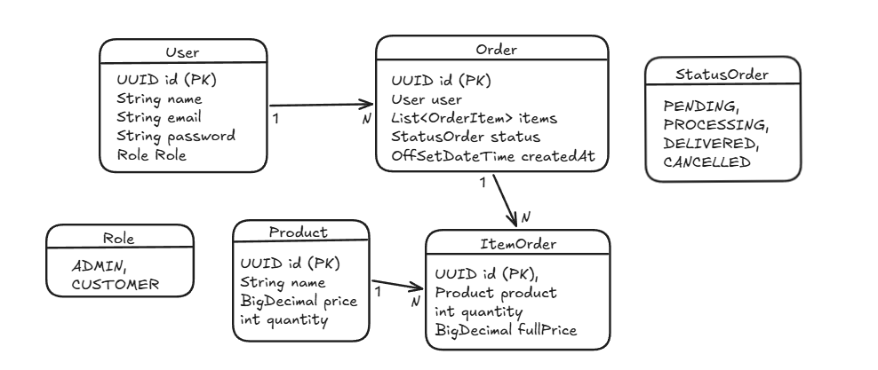

# 🛒 Sistema de Pedidos API

Uma API REST robusta desenvolvida com **Spring Boot 4** e **Java 21** para o gerenciamento de produtos, usuários e pedidos, seguindo os princípios de **Domain-Driven Design (DDD)**, **Clean Architecture** e tratando erros de forma padronizada via **RFC 7807 (Problem Detail)**.

---

## 📌 Sumário
- [Sobre o Projeto](#-sobre-o-projeto)
- [Tecnologias Utilizadas](#-tecnologias-utilizadas)
- [Arquitetura e Decisões de Design](#-arquitetura-e-decisões-de-design)
- [Desenho da Modelagem de dados](#-desenho-da-modelagem-de-dados)
- [Como Executar o Projeto](#-como-executar-o-projeto)
- [Documentação da API (Swagger)](#-documentação-da-api-swagger)

---

## 📖 Sobre o Projeto

O **Sistema de Pedidos** é um backend responsável por orquestrar a criação de pedidos, atualização de estoque e gerenciamento de status de pedidos. O sistema garante a integridade transacional das operações, impedindo vendas com estoque insuficiente ou transições inválidas no fluxo do pedido.

---

## 🛠️ Tecnologias Utilizadas

- **Linguagem:** Java (21)
- **Framework:** Spring Boot 4.x
- **Persistência de Dados:** Spring Data JPA / Hibernate
- **Banco de Dados:** PostgreSQL
- **Migração de Banco:** Flyway
- **Validação:** Bean Validation (`jakarta.validation`)
- **Documentação:** Springdoc OpenAPI / Swagger UI
- **Build & Dependências:** Apache Maven
- **Utilitários:** Lombok / Java Records (DTOs)

---

## 🏛️ Arquitetura e Decisões de Design

A aplicação segue preceitos do **Domain-Driven Design (DDD)** para manter o domínio isolado de detalhes de infraestrutura e garantir alta manutenibilidade:

1. **Encapsulamento do Domínio:** As entidades de negócio (ex: `Product`, `Order`) contêm a lógica de estado e invariantes através de *Guard Clauses*.
2. **DTOs Imutáveis com Records:** Utilização de Java `record` para transporte de dados nas camadas de entrada e saída.
3. **Casos de Uso (Use Cases):** Orquestração clara das regras de aplicação separada das operações básicas de serviço.
4. **Tratamento Global de Exceções (RFC 7807):** Respostas de erro padronizadas e sem acoplamento com o framework usando `ProblemDetail` para representar exceções de negócio (`BusinessRuleException`), recursos não encontrados (`ResourceNotFoundException`) e falhas de contrato/sintaxe (`HttpMessageNotReadableException`).

---

## 📐 Desenho da Modelagem de Dados

<p align="center">
  
</p>

---

## 🚀 Como Executar o Projeto

A aplicação é containerizada e pode ser iniciada rapidamente com **Docker Compose**, subindo a API e o banco de dados PostgreSQL com todas as variáveis tratadas via arquivo `.env`.

### 1. Pré-requisitos
- Java 21 e Maven (caso opte por rodar localmente via ./mvnw)
- Docker e Docker Compose instalados.

---

### 1. **Clonar o repositório:**
   ```bash
   git clone https://github.com/fcolucasvieira/sistema_pedidos.git
   cd sistema_pedidos
   ```

### 2. Configurar o Arquivo `.env`
Crie um arquivo `.env` na raiz do projeto (ou duplique o exemplo fornecido) com as credenciais do banco e configurações da aplicação:

    POSTGRES_DB=sistema_pedidos
    POSTGRES_USER=postgres
    POSTGRES_PASSWORD=postgres
    DEFAULT_PASSWORD=default_password

### 3. Executar com Docker Compose
Suba o ambiente de banco de dados e aplicação em segundo plano:

    docker compose up -d
    
O Docker Compose cuidará da criação da rede, inicialização do PostgreSQL e provisionamento dos serviços.

--- 

## 📚 Documentação da API (Swagger)
A API conta com documentação interativa gerada via Springdoc OpenAPI. Com a aplicação em execução, acesse:
- 🌐 Swagger UI: http://localhost:8080/swagger-ui.html

---

# 👨‍💻 Autor

**Lucas Vieira**:

Estudante de Engenharia de Computação — UFC Sobral

- GitHub: [github.com/fcolucasvieira](https://github.com/fcolucasvieira)
- LinkedIn: [linkedin.com/in/fco-lucas-vieira](https://www.linkedin.com/in/fco-lucas-vieira/)

